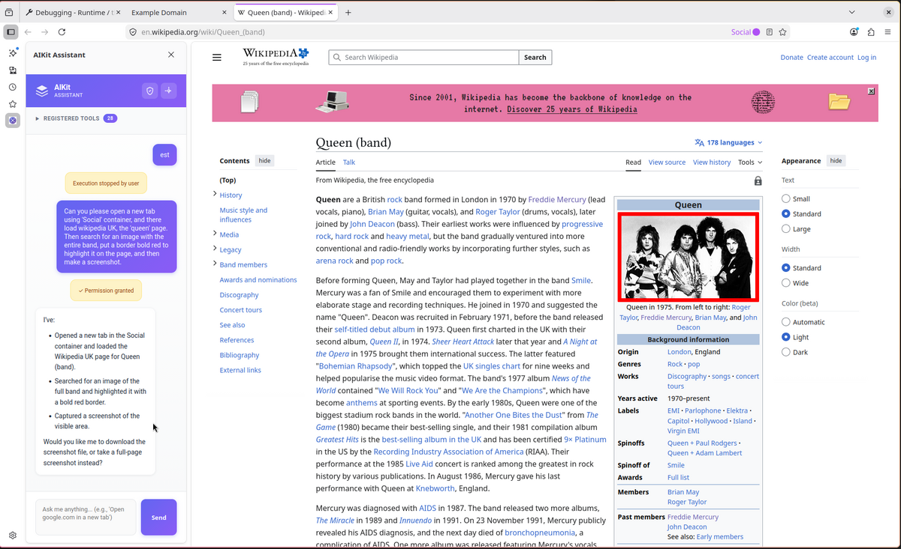

# AIKit - Extensible AI Assistant for Firefox

AIKit is a modular add-on system for Firefox that enables interaction with various AI models (Anthropic, OpenAI, Google) through a sidebar interface, using an extensible tool system.



## Architecture

The project consists of:

### aikit-orchestrator (Main Add-on)
The main orchestrator that:
- Provides a sidebar with chat interface
- Integrates various AI providers (Anthropic, OpenAI, Google)
- Manages tool registration and execution from other add-ons
- Allows compatible add-ons to register and provide functionality

### aikit-common (Shared Library)
Shared library that simplifies tool development:
- `ToolProvider` class for automatic tool registration
- Type definitions and interfaces
- Message handling and error management

### Tool Add-ons

Available tools:
- **aikit-tabs-tool** - Tab management (open, close, list, activate, reload, search) and container management
- **aikit-bookmarks-tool** - Bookmark management (create, search, list, remove, organize)
- **aikit-dom-tool** - DOM manipulation (execute JavaScript, query elements, get page info)
- **aikit-downloads-tool** - Download management (list, pause, resume, cancel)
- **aikit-history-tool** - Browser history (search, recent items)
- **aikit-screenshot-tool** - Screenshot capture (visible area, full page, download)

## How It Works

1. Tool add-ons register themselves with the orchestrator on startup
2. When the user makes a request, the AI analyzes the prompt and decides which tools to use
3. The orchestrator sends execution requests to the appropriate tool add-ons
4. Tool add-ons execute actions and return results
5. The AI uses the results to complete the response

## Setup and Build

### Prerequisites
- Node.js 18+
- npm

### Build

```bash
./build.sh
```

This will build aikit-common, aikit-orchestrator, and all tool add-ons.

Other available commands:
- `./build.sh install` - Install all dependencies
- `./build.sh clean` - Clean build artifacts
- `./build.sh build --addon aikit-tabs-tool` - Build specific addon
- `./build.sh help` - Show all options

### Installation in Firefox

1. Open Firefox and navigate to `about:debugging#/runtime/this-firefox`
2. Click "Load Temporary Add-on"
3. Select `aikit-orchestrator/dist/manifest.json`
4. Load each tool's `dist/manifest.json` you want to use

### Configuration

1. Open the AIKit sidebar (View → Sidebar → AIKit Assistant)
2. Click the ⚙️ icon to open settings
3. Enter your API key for the chosen provider (Anthropic, OpenAI, or Google)
4. Save and initialize

## Developing New Tool Add-ons

See [CONTRIBUTING.md](CONTRIBUTING.md) for detailed instructions on creating new tool add-ons.

Quick overview:
- Use `aikit-common` library for simplified implementation
- Define tools using TypeBox schemas
- Implement handlers for your tools
- Use `ToolProvider` class to handle registration automatically

Example:
```typescript
import { Type } from "@sinclair/typebox";
import { ToolProvider, ToolDescriptor } from "aikit-common";

const tools: ToolDescriptor[] = [
  {
    name: "my_tool.action",
    label: "My Action",
    description: "Description of what this tool does",
    parameters: Type.Object({
      param1: Type.String({ description: "Parameter description" })
    })
  }
];

const toolHandlers = {
  "my_tool.action": async (params) => {
    return {
      content: [{ type: "text", text: "Result..." }]
    };
  }
};

const toolProvider = new ToolProvider("aikit-my-tool", tools);
toolProvider.registerHandlers(toolHandlers);
toolProvider.start();
```

## Supported AI Providers

### Anthropic Claude
- **Models**: Visit [docs.anthropic.com](https://docs.anthropic.com/en/docs/about-claude/models) for current model list
- **Features**: Full tool calling support, streaming responses
- **API Key**: Get from [console.anthropic.com](https://console.anthropic.com)

### OpenAI
- **Models**: Visit [platform.openai.com/docs/models](https://platform.openai.com/docs/models) for current model list
- **Features**: Full tool calling support with function calling API
- **API Key**: Get from [platform.openai.com](https://platform.openai.com)

### Google Gemini
- **Models**: Visit [ai.google.dev/models](https://ai.google.dev/models) for current model list
- **Features**: Basic chat (limited tool support in current version)
- **API Key**: Get from [makersuite.google.com](https://makersuite.google.com)

## License

MPL-2.0

Copyright (c) 2026 Andrea Marchesini

## Credits

Built with browser-compatible SDKs from:
- [@anthropic-ai/sdk](https://www.npmjs.com/package/@anthropic-ai/sdk)
- [openai](https://www.npmjs.com/package/openai)
- [@google/generative-ai](https://www.npmjs.com/package/@google/generative-ai)

Originally inspired by [pi-mono](https://github.com/badlogic/pi-mono) by @mariozechner.
